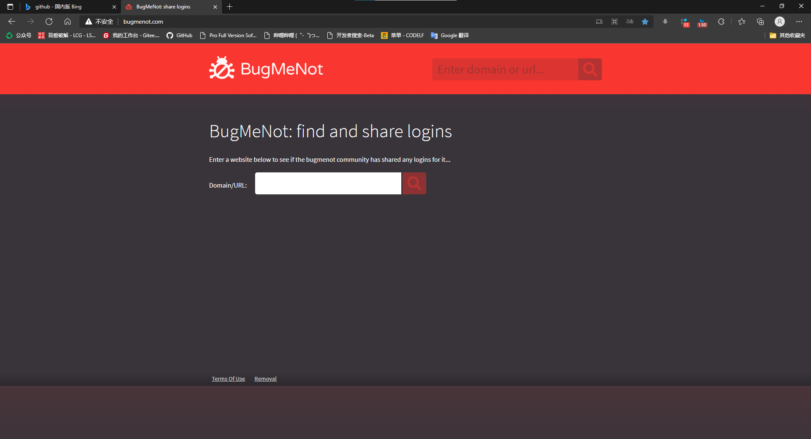

# Bear的网络随笔

## 前言

算是记录,也算是给一些网络小白的一些介绍吧,算是为了大家更好的在互联网的世界中漫游吧

我会将我的一些平时所使用的一 一介绍.

不一定非常专业,但对于大部分人也会有不少收获

我不擅长表达些什么,有时可能会写的不易理解,望见谅,与指导

## 浏览器篇

此处先从PC介绍吧.

对于大部分人来说使用浏览器的机会应该会很多吧,所以,如何更好的使用浏览器也非常重要

比较知名的浏览器软件也就那么几种,对于国内

我主要推荐新版的     **Edge**

目前windows 10自带

打开后,部分电脑,可能会使用的百度搜索引擎

建议使用的bing搜索引擎吧

具体操作如下:

### 浏览器扩展 

然后嘛,下扩展,这很重要,能为我们带来许多便利

这里推荐几款通用的扩展吧

这个可自定义视频速度,最高16倍速看视频

这个我还没尝试过,有需求可以试试

就前面三个算是下载一下吧,之后推荐的一些插件会和某些软件配套使用,所以介绍该软件时再细谈.

### 翻译

对于纯英文的网页,可以**单击鼠标右键**,选中翻译成中文

### 收藏夹与集锦

对于使用频繁的网页

可使用 收藏夹或集锦

其中收藏夹会将网页的快捷访问放在下面,如上图下面的数个网站.

集锦呢,大概是将你认为的多个网站进行分类汇总的

如,我在C++的集锦中,存放了三个相关的网站地址

### 网站推荐

普通用户

最近发现了一个看小说的网站

github上的一个项目,搜索owlook会有好几个网站吧

[owlook(owlook.com.cn)](https://www.owlook.com.cn/)

这里算是主要给计算机相关专业人员的推荐了

[程序员导航(tooool.org)](http://tooool.org/)

[免费中国手机号码 在线接收短信 - 免费接码 (mianfeijiema.com)](https://mianfeijiema.com/sms/8616517525571)

其实搜索引擎打开     搜索 临时手机号   有多个类似网站   同理   也有临时邮箱 之类.

[BugMeNot: share logins](http://bugmenot.com/)

这是一个一些网站的账户共享的网站,将目标网站路径复制进去即可

如下载JDK需要的Oracle账号

那就先这样吧,有时间慢慢更新!

