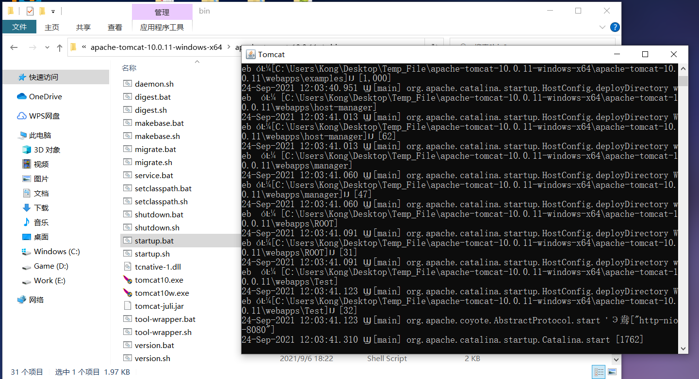
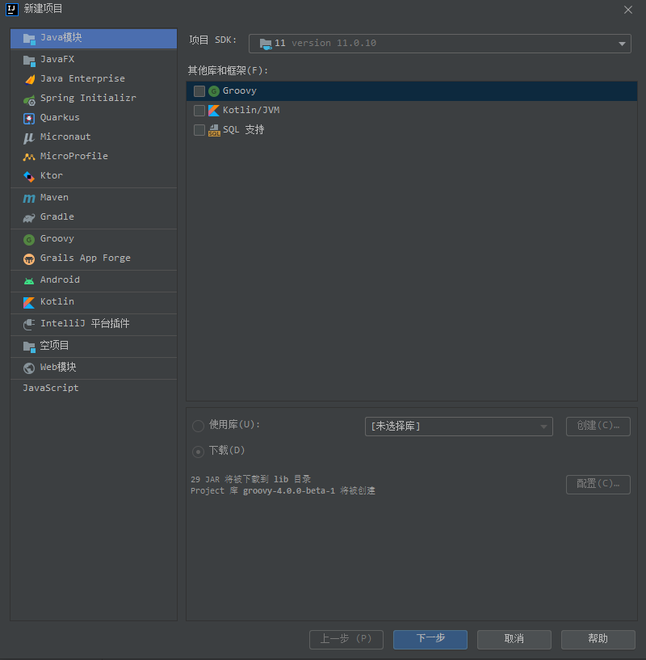
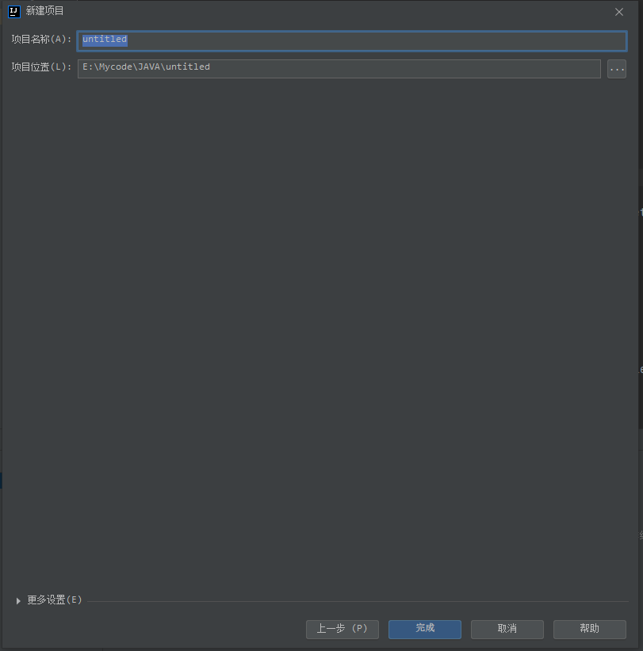
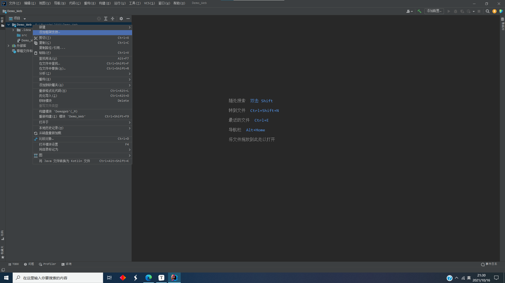
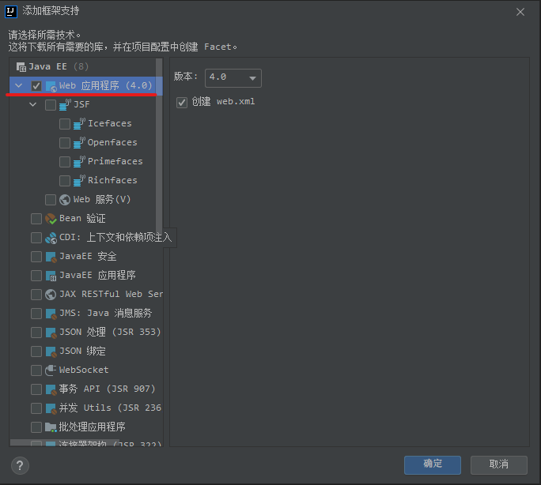
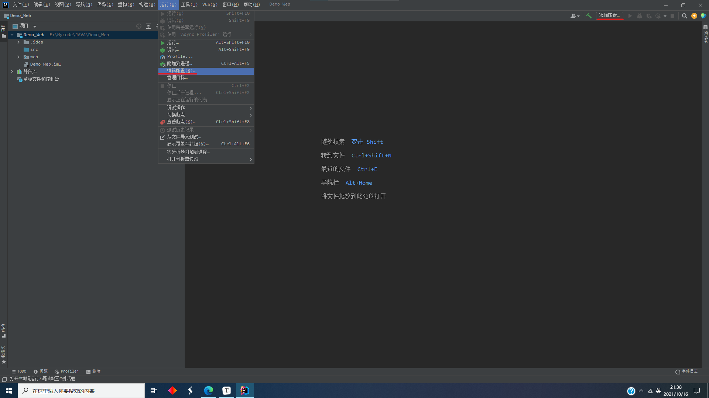
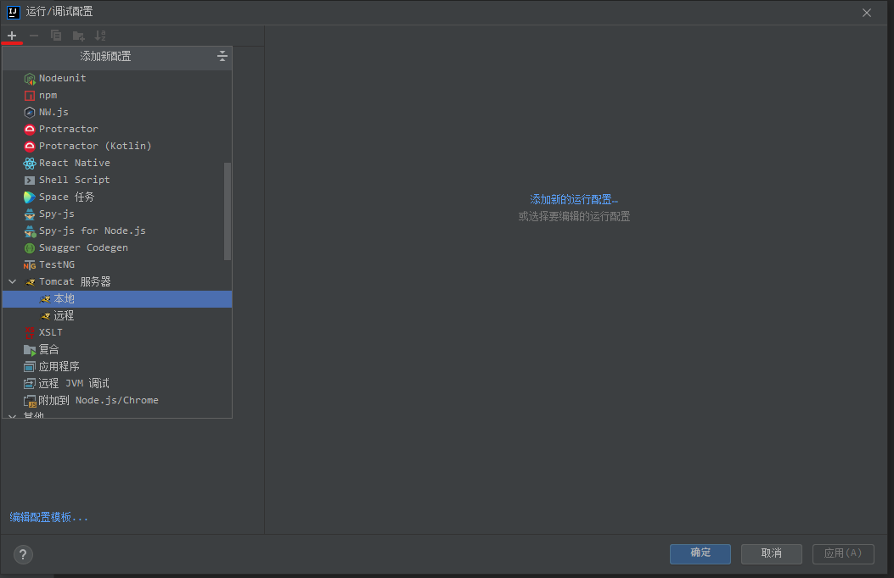
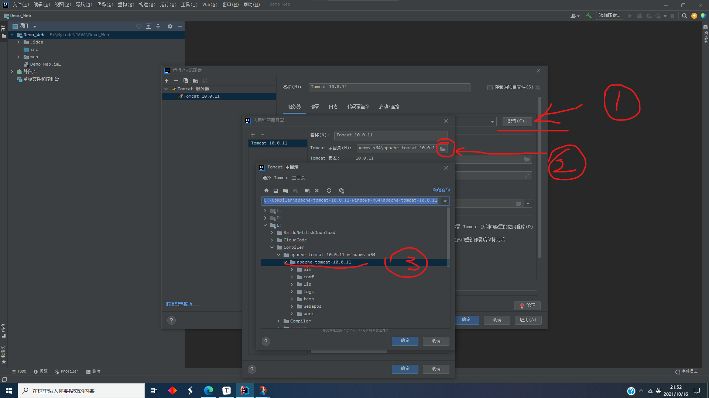
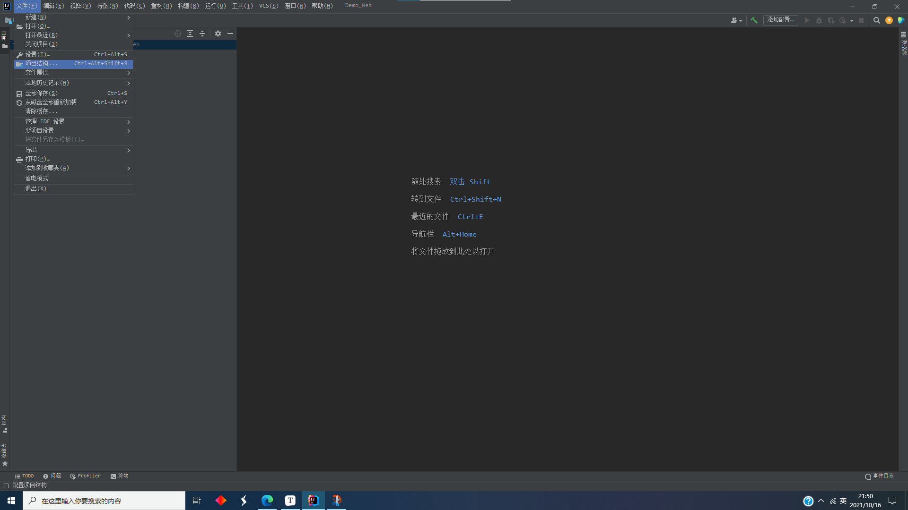
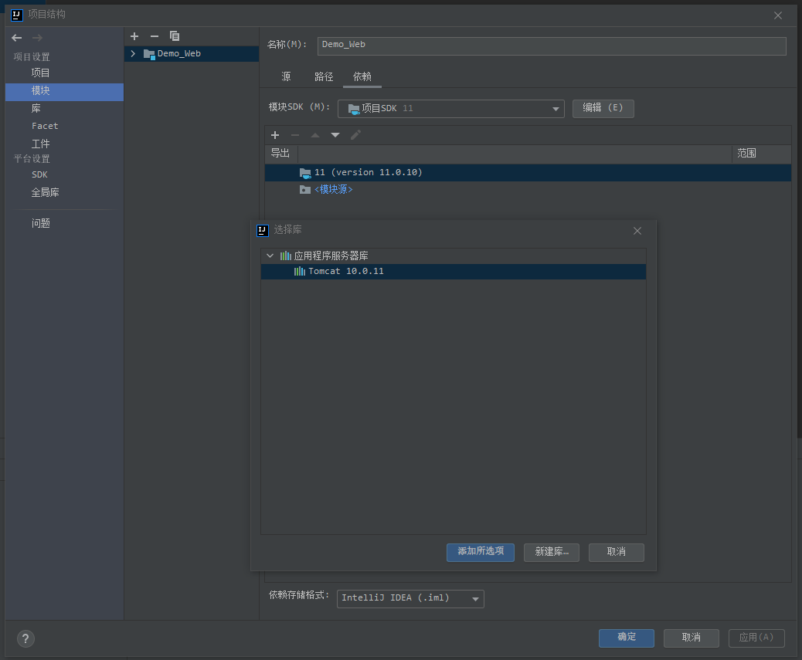

## idea 2021 2.2 构建JavaWeb环境

供初学JavaWeb者使用

# 准备阶段

软件(已有请忽略)

**JDK** 

**Tamcat**

**idea 2021 2.2**

说明：

关于配置JDK不讲解

关于idea 试用或破解不讲解

关于idea中文不讲解

若有相关问题，请自行网上搜索，有极多答案。

### Tomcat运行判断

首先请判断Tomcat能否正常运行

启动文件 (即双击文件)   为**bin**目录下的  **startup.bat**      (请打开**显示文件扩展名**)

点击后出现如上情况,即可正常使用

若启动时一闪而过,或无法启动

大部分情况为  **JAVA环境变量未配置好**

请重新配置  **JAVA_HOME**    (注意使用**JAVA_HOME**,而非直接将路径写入**path**内)

### IDEA项目的构建

新建项目

什么都不用选,一直下一步即可,注意改一下项目的存储位置

**在项目名上右击鼠标**   点击**添加框架支持**

勾选 **web应用程序**    然后直接**确定**

点击  **运行->编辑配置**        或右上角的   **添加配置**

点击**左上角** 加号(＋)    选择**Tomcat 服务器   本地**               注意：**不要选择TomEE  服务器！！！**

注意：选中包含了bin，conf，lib等目录的文件夹即可

说三遍：

点击       **修正**

点   **修正**

**修正**

然后   确定

**到最后步骤了**                  文件->项目结构

**模块->依赖->加号(+)->选择库->Tomcat**       然后**添加所选项**

然后   勾选中    确定    即可

