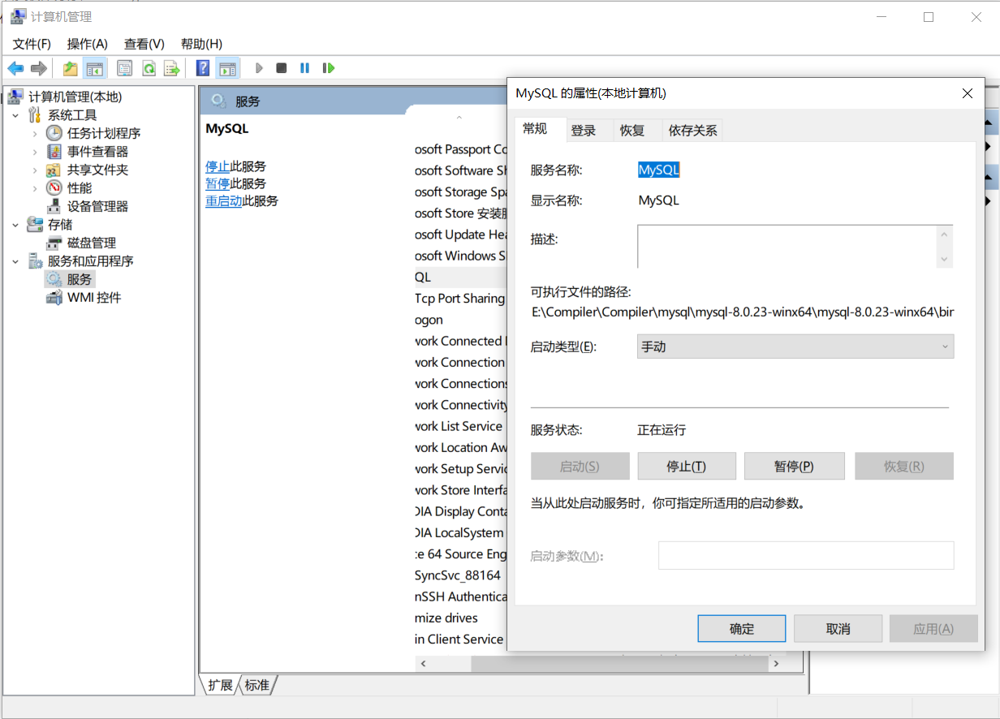

# Git

| 命令              | 说明                                     |
| :---------------- | :--------------------------------------- |
| `git init`        | 初始化一个仓库                           |
| `git clone (url)` | 拷贝一份远程仓,即下载                    |
| `git add`         | 添加文件到仓库                           |
| `git add`         | 添加文件到仓库                           |
| `git status`      | 查看仓库当前的状态，显示有变更的文件。   |
| `git diff`        | 比较文件的不同，即暂存区和工作区的差异。 |
| `git commit`      | 提交暂存区到本地仓库。                   |
| `git reset`       | 回退版本。                               |
| `git rm`          | 删除工作区文件。                         |
| `git mv`          | 移动或重命名工作区文件。                 |
| `git remote`      | 远程仓库操作                             |
| `git fetch`       | 从远程获取代码库                         |
| `git pull`        | 下载远程代码并合并                       |
| `git push`        | 上传远程代码并合并                       |

# Mysql

程序包安装与使用

```sql
mysqld –initialize -insecure        
初始化数据库，并设置默认root密码为空
```
|说明   | 命令 |
| :----: | :--------------- |
|   安装   | `mysqld --install` |
|   卸载   | `mysqld --remove` |
| 启动服务 | `net start mysq` |
| 停止服务 | `net stop mysql` |

配置环境变量后,在Windows PowerSheel中安装,然后 初始化 即可使用

```sql
进入mysql           mysql -u root -p
```

**安装后,默认开机启动**,若想设置手动启动,进行如下操作




# VMware  激活码

**VM16**激活码

```text
YF390-0HF8P-M81RQ-2DXQE-M2UT6
ZF71R-DMX85-08DQY-8YMNC-PPHV8
ZF3R0-FHED2-M80TY-8QYGC-NPKYF
```

